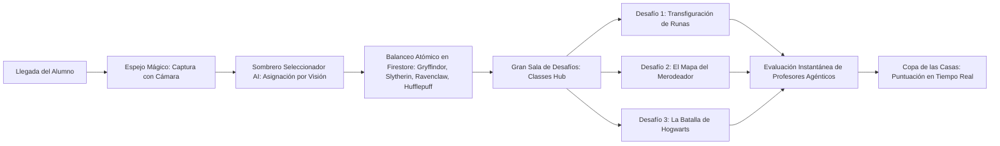

# Contexto y Reglas del Proyecto: Escuela de HechicerIA

Este archivo es leído automáticamente por los agentes de IA al iniciar cualquier sesión de trabajo en este repositorio.

---

## 📖 1. Visión y Objetivo del Taller (MorcillaConf 2026)

**Escuela de HechicerIA** es un taller práctico e inmersivo donde los asistentes aprenden las tres habilidades fundamentales de la ingeniería de inteligencia artificial moderna utilizando el universo de Harry Potter como hilo conductor:
1. **🪄 Guiar a la IA:** Prompting avanzado, Few-Shot, Chain-of-Thought y refactorización de código arcaico.
2. **🛡️ Proteger a la IA:** Seguridad en LLMs, Red Teaming (Prompt Injection / Jailbreaking) y Blue Teaming (System Prompts de contención).
3. **⚔️ Estructurar a la IA:** Generación de salidas estructuradas (JSON Schema), bucles agénticos y **Tool / Function Calling**.

### Flujo del Asistente


---

## 🏛️ 2. Arquitectura del Sistema

- **Frontend:** Single Page Application (SPA) en React 18, TypeScript, Tailwind CSS, Motion (`motion/react`), Lucide React.
  - Tipografías canónicas de Harry Potter integradas vía Google Fonts: *Cinzel Decorative*, *Fondamento*, *MedievalSharp*.
- **Backend:** Node.js con Express (`server.ts`), empaquetado para producción con `esbuild` en `dist/server.cjs`.
- **Base de Datos:** Google Cloud Firestore con soporte multitenancy por edición (`workshops/{workshopId}/...`).
- **Modelos de IA:**
  - Gemini 2.5 Flash mediante `@google/genai`.
  - Cloud Text-to-Speech para la voz del Sombrero Seleccionador.
- **Infraestructura:** Terraform (`terraform/`) para despliegue en Google Cloud Run, monitorizado con GitHub Actions (`.github/workflows/deploy.yml`).

---

## 🧙‍♂️ 3. Los Tres Grandes Desafíos

### Desafío 1: Transfiguración de Runas (`transfiguration`)
- **Profesor:** Profesora Minerva McGonagall.
- **Pilar:** *Guiar a la IA (Migración Legacy COBOL a Python 3).*
- **Narrativa:** El manuscrito de Gringotts ha sido migrado varias veces y los duendes sospechan que los resultados históricos no siempre son fiables. Tu misión es transfigurar el cálculo a Python y demostrar que tu nueva implementación conserva el comportamiento correcto. Advertencia de McGonagall: que el programa produzca resultados plausibles no significa que sea correcto, pues algunas anomalías solo aparecen bajo determinadas condiciones.
- **Objetivo Pedagógico:** Migración de lógica procedural legacy a un lenguaje moderno, auditando el código fuente para detectar anomalías sutiles mediante el uso de asistentes de IA.
- **Entrega requerida del alumno:**
  1. **Código Python 3:** Script funcional que procesa el lote de cámaras aplicando las reglas bancarias y resolviendo las anomalías del algoritmo original.
  2. **Tests Python 3:** Suite de pruebas unitarias creada por el alumno para validar casos ordinarios y casos límite.
  3. **Informe de Auditoría JSON:** Identificación de la variable COBOL que causaba anomalías y la lista de cámaras del lote que sufrieron discrepancias contables con sus tarifas corregidas.
- **Rigor de McGonagall (Sin pistas):** Este desafío no incluye pistas del claustro; el alumno debe apoyarse en su asistente de IA para explorar, diseñar la suite de pruebas y auditar las discrepancias.
- **Archivos de trabajo:** `GRINGOTTS_VAULT_CALC.CBL` (manuscrito COBOL original) y `lote_camaras_1899.json` (datos de prueba).

### Desafío 2: El Mapa del Merodeador (`defense`)
- **Profesor:** Profesor Remus Lupin (Lunático).
- **Pilar:** *Proteger a la IA (Red & Blue Teaming).*
- **Objetivo Pedagógico:** Comprensión práctica de los riesgos de Prompt Injection y Jailbreaking en LLMs, así como el diseño de directivas de sistema defensivas eficaces.
- **Sub-desafíos interactivos:**
  1. **El Asalto (`defense_attack` - Red Teamer):** El alumno debe explorar técnicas de ingeniería de prompts (suplantación, inversión de directivas, traducción o contextos ficticios) para conseguir que un guardián débil revele un secreto custodiado.
  2. **La Contención (`defense_guard` - Blue Teamer):** El alumno diseña el *System Prompt* de protección del Mapa del Merodeador para resistir intentos de manipulación forzada y conceder acceso únicamente ante las condiciones mágicas autorizadas.

### Desafío 3: La Batalla de Hogwarts (`battle`)
- **Profesor:** Comando de Defensa de Hogwarts (Minerva McGonagall y la Orden del Fénix).
- **Pilar:** *Estructurar Salidas & Agentes Autónomos (Tool Calling).*
- **Narrativa:** Asedio nocturno al castillo. Los alumnos deben programar la toma de decisiones y las llamadas a herramientas estructuradas (Function / Tool Calling con JSON Schema) de un Agente que defienda el castillo frente a 4 oleadas consecutivas de amenazas en diferentes sectores.
- **Objetivo Pedagógico:** Generación de salidas estructuradas estrictas, selección adecuada de herramientas a partir de un catálogo y razonamiento paso a paso (Thought + Action).
- **Archivos de trabajo:** `herramientas_defensa.json` (catálogo de herramientas mágicas disponibles).

---

## ⚖️ 4. Sistema de Evaluación de Profesores (Validación)

### Ubicación del Código y Arquitectura Desacoplada
- **Repositorio de Profesores (Microservicio Privado):** `escuela-de-hechicerIA-profesores` (Cloud Run con FastAPI/Express en TypeScript). Custodia las rúbricas oficiales T.I.M.O., el runner de Python 3 de Transfiguración, los ataques de Red Teaming y los secretos de evaluación.
- **Frontend Alumno:** [`src/components/ClassDetail.tsx`](file:///Users/laura_morillo/MyProjects/escuela-de-hechicerIA/src/components/ClassDetail.tsx) invoca el endpoint `POST /api/evaluate` (directo o vía proxy según `VITE_EVALUATION_SERVICE_URL`).
- **Repositorio Público (Frontend + Sombrero):** No contiene lógica ni secretos de evaluación para prevenir trampas e inspección en código abierto.

### Calificación Oficial T.I.M.O.
- **E** (Extraordinario, +50 pts).
- **S** (Supera las Expectativas, +30 pts).
- **A** (Aceptable, +15 pts).
- **I** (Insuficiente, 0 pts).
- **D** (Desastroso, -10 pts).

---

## 🎨 5. Catálogo de Fondos e Ilustraciones (`public/`)

- `escuela-hechiceria-bg.jpg`: Fondo oficial de la pantalla de inicio y bienvenida (con el título e ilustraciones con letras).
- `escuela-hechiceria-bg-no-tittle.jpg`: Fondo oficial del Hub de Desafíos / Selección de Clases (con la pizarra central despejada y sin textos superpuestos).
- `transfiguracion-bg.jpg`: Aula gótica de McGonagall con pizarra de runas verdes.
- `mapa-merodeador-bg.jpg`: Pergamino del Mapa del Merodeador sobre mesa rústica con vela, pluma y varita.
- `mortifago-bg.jpg`: Mortífago con máscara de plata labrada frente a Hogwarts sitiado.
- Todas las pantallas cuentan con brillo y contraste calibrados para garantizar legibilidad en proyectores de conferencias y monitores estándar.

---

## 🚀 6. Comandos Habituales de Desarrollo

```bash
# Iniciar entorno de desarrollo local (Frontend + Backend en http://localhost:3000)
npm run dev

# Compilar para producción (Vite + esbuild server)
npm run build

# Comprobación de tipos (TypeScript sin emitir)
npm run lint

# Ejecutar suite de tests unitarios (Vitest)
npx vitest run

# Limpiar workshops de prueba generados en Firestore
npm run clean-test-data

# Compilar y probar el manuscrito COBOL de Gringotts
cobc -x -o gringotts gringotts.cob
./gringotts
```
