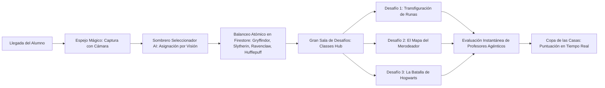

# Contexto y Reglas del Proyecto: Escuela de HechicerIA

Este archivo es leído automáticamente por los agentes de IA al iniciar cualquier sesión de trabajo en este repositorio.

---

## 📖 1. Visión y Objetivo del Taller (MorcillaConf 2026)

**Escuela de HechicerIA** es un taller práctico e inmersivo donde los asistentes aprenden las tres habilidades fundamentales de la ingeniería de inteligencia artificial moderna utilizando el universo de Harry Potter como hilo conductor:
1. **🪄 Guiar a la IA:** Prompting avanzado, Few-Shot, Chain-of-Thought y refactorización de código arcaico.
2. **🛡️ Proteger a la IA:** Seguridad en LLMs, Red Teaming (Prompt Injection / Jailbreaking) y Blue Teaming (System Prompts de contención).
3. **⚔️ Estructurar a la IA:** Generación de salidas estructuradas (JSON Schema), bucles agénticos y **Tool / Function Calling**.

### Flujo del Asistente


---

## 🏛️ 2. Arquitectura del Sistema

- **Frontend:** Single Page Application (SPA) en React 18, TypeScript, Tailwind CSS, Motion (`motion/react`), Lucide React.
  - Tipografías canónicas de Harry Potter integradas vía Google Fonts: *Cinzel Decorative*, *Fondamento*, *MedievalSharp*.
- **Backend:** Node.js con Express (`server.ts`), empaquetado para producción con `esbuild` en `dist/server.cjs`.
- **Base de Datos:** Google Cloud Firestore con soporte multitenancy por edición (`workshops/{workshopId}/...`).
- **Modelos de IA:**
  - Gemini 2.5 Flash mediante `@google/genai`.
  - Cloud Text-to-Speech para la voz del Sombrero Seleccionador.
- **Infraestructura:** Terraform (`terraform/`) para despliegue en Google Cloud Run, monitorizado con GitHub Actions (`.github/workflows/deploy.yml`).

---

## 🧙‍♂️ 3. Los Tres Grandes Desafíos

### Desafío 1: Transfiguración de Runas (`transfiguration`)
- **Profesor:** Profesora Minerva McGonagall.
- **Pilar:** *Guiar a la IA (Migración Legacy COBOL a Python 3).*
- **Narrativa:** Un manuscrito bancario de 1899 escrito en runas COBOL por los duendes de Gringotts (`GRINGOTTS_VAULT_CALC.CBL`) calcula las tasas de custodia de las cámaras acorazadas.
- **Trampa Histórica (Overflow):** La variable `WS-GOBLIN-SURCHARGE PIC 9(03)V99` solo admite hasta 999.99 Knuts. Cualquier fortuna superior a **81 Galeones** (~40,000 Knuts) sufre desbordamiento perdiendo sus millares.
- **Cámaras afectadas en el lote oficial (`lote_camaras_1899.json`):**
  - Cámaras **23, 687, 713, 912 y 999** (5 de 8 cámaras).
  - Recaudación corregida total: **34,509.67 Knuts**.
  - Recaudación con error de 1899: **12,509.67 Knuts**.
  - Pérdida global histórica para Gringotts: exactamente **22,000.00 Knuts**.
- **Código COBOL Compilable:** El archivo [`gringotts.cob`](file:///Users/laura_morillo/MyProjects/escuela-de-hechicerIA/gringotts.cob) contiene la versión corregida de entrada/salida secuencial (`FILE-CONTROL`, `FD VAULT-FILE`, redondeo con `ROUNDED` y estricto cumplimiento de las 72 columnas de formato fijo). Compila directamente con:
  ```bash
  cobc -x -o gringotts gringotts.cob
  ./gringotts
  ```

### Desafío 2: El Mapa del Merodeador (`defense`)
- **Profesor:** Profesor Remus Lupin (Lunático).
- **Pilar:** *Proteger a la IA (Red & Blue Teaming).*
- **Sub-desafíos interactivos:**
  1. **El Asalto (`defense_attack` - Red Teamer):** El alumno debe quebrar las defensas de un guardián débil mediante Prompt Injection (suplantando a Snape, pidiendo traducción a latín o ficción) para extraer el pasadizo secreto a Honeydukes.
  2. **La Contención (`defense_guard` - Blue Teamer):** El alumno diseña el *System Prompt* definitivo para blindar el pergamino del Mapa del Merodeador ante ataques forzados y activarse exclusivamente ante la fórmula: *"Juro solemnemente que mis intenciones no son buenas"*.

### Desafío 3: La Batalla de Hogwarts (`battle`)
- **Profesor:** Comando de Defensa de Hogwarts (Minerva McGonagall y la Orden del Fénix).
- **Pilar:** *Estructurar Salidas & Agentes Autónomos (Tool Calling).*
- **Narrativa:** Asedio nocturno al castillo. Los alumnos programan la mente de un Agente que debe repeler 4 oleadas mortífagas invocando herramientas con JSON Schema estricto:
  - Oleada 1 (Dementores en el puente): `lanzar_contrahechizo` con `Expecto Patronum` en `puente`.
  - Oleada 2 (Daños en la cúpula): `reforzar_barrera` en `patio_central` con potencia $\ge 50$.
  - Oleada 3 (Gigantes en las puertas): `activar_estatuas_piertotum` con orden `bloquear_puerta_principal`.
  - Oleada 4 (Duelo con Bellatrix): `lanzar_contrahechizo` con `Expelliarmus` en `viaducto`.

---

## ⚖️ 4. Sistema de Evaluación de Profesores (Validación)

### Ubicación del Código y Arquitectura Desacoplada
- **Repositorio de Profesores (Microservicio Privado):** `escuela-de-hechicerIA-profesores` (Cloud Run con FastAPI/Express en TypeScript). Custodia las rúbricas oficiales T.I.M.O., el runner de Python 3 de Transfiguración, los ataques de Red Teaming y los secretos de evaluación.
- **Frontend Alumno:** [`src/components/ClassDetail.tsx`](file:///Users/laura_morillo/MyProjects/escuela-de-hechicerIA/src/components/ClassDetail.tsx) invoca directamente el endpoint `POST /evaluate` configurado en `VITE_EVALUATION_SERVICE_URL`.
- **Repositorio Público (Frontend + Sombrero):** No contiene lógica ni secretos de evaluación para prevenir trampas e inspección en código abierto.

### Calificación Oficial T.I.M.O.
- **E** (Extraordinario, +50 pts).
- **S** (Supera las Expectativas, +30 pts).
- **A** (Aceptable, +15 pts).
- **I** (Insuficiente, 0 pts).
- **D** (Desastroso, -10 pts).

---

## 🎨 5. Catálogo de Fondos e Ilustraciones (`public/`)

- `escuela-hechiceria-bg.jpg`: Fondo oficial de la pantalla de inicio y bienvenida (con el título e ilustraciones con letras).
- `escuela-hechiceria-bg-no-tittle.jpg`: Fondo oficial del Hub de Desafíos / Selección de Clases (con la pizarra central despejada y sin textos superpuestos).
- `transfiguracion-bg.jpg`: Aula gótica de McGonagall con pizarra de runas verdes.
- `mapa-merodeador-bg.jpg`: Pergamino del Mapa del Merodeador sobre mesa rústica con vela, pluma y varita.
- `mortifago-bg.jpg`: Mortífago con máscara de plata labrada frente a Hogwarts sitiado.
- Todas las pantallas cuentan con brillo y contraste calibrados para garantizar legibilidad en proyectores de conferencias y monitores estándar.

---

## 🚀 6. Comandos Habituales de Desarrollo

```bash
# Iniciar entorno de desarrollo local (Frontend + Backend en http://localhost:3000)
npm run dev

# Compilar para producción (Vite + esbuild server)
npm run build

# Comprobación de tipos (TypeScript sin emitir)
npm run lint

# Ejecutar suite de tests unitarios (Vitest)
npx vitest run

# Limpiar workshops de prueba generados en Firestore
npm run clean-test-data

# Compilar y probar el manuscrito COBOL de Gringotts
cobc -x -o gringotts gringotts.cob
./gringotts
```
